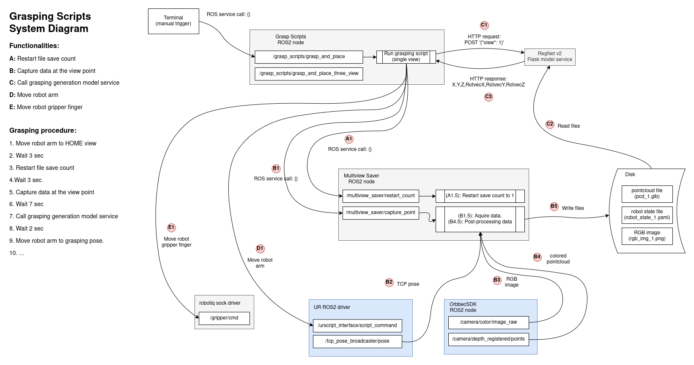

# Grasp Script

This ROS2 node is designated as a script, which triggered by user then executes commands step by step. Currently this node has 5 kinds of command could be executed:
1. Restart file save count
2. Capture data at the view point
3. Call grasping generation model service
4. Move robot arm
5. Move robot gripper finger


## System diagram




## Dependency

This ROS2 node cooperates with the following tools:
1. [Universal Robots ROS2 Driver (humble branch) - github.com](https://github.com/UniversalRobots/Universal_Robots_ROS2_Driver/tree/humble)
2. [OrbbecSDK ROS2 (v2-main branch) - github.com](https://github.com/orbbec/OrbbecSDK_ROS2/tree/v2-main)
3. [multiview_saver - github.com](https://github.com/Mimamsa/multiview_saver)
4. [general_grasp_generation - github.com](https://github.com/Mimamsa/general_grasp_generation)
5. [robotiq_sock_driver - github.com](https://github.com/Mimamsa/robotiq_sock_driver)


## Environment

- Ubuntu 22.04
- Python 3.10
- ROS2 Humble


## Build

### 1. Create directories

For my example, all ROS2 package are in ```~/ros2_ws/src``` directory.

```
mkdir -p ~/ros2_ws/src
cd ~/ros2_ws/src
git clone https://github.com/Mimamsa/multiview_saver
```

### 2. Build individual package

```
cd ~/ros2_ws
colcon build --packages-select grasp_scripts
```


## Usage

### Launch node

```
ros2 launch grasp_scripts grasp_and_place.launch.py
```

### Call single camera view script

Please check the callback function ```grasp_and_place_service_callback``` to see the entire procedure.
```
ros2 service call /grasp_scripts/grasp_and_place std_srvs/srv/Trigger {}
```

### Call triple camera view script

Please check the callback function ```grasp_and_place_three_view_service_callback``` to see the entire procedure.

```
ros2 service call /grasp_scripts/grasp_and_place_three_view std_srvs/srv/Trigger {}
```


## Inforation

- Author: Yu-Hsien Chen (mike_chen@wistron.com)
- Latest update: 2025/6/11
